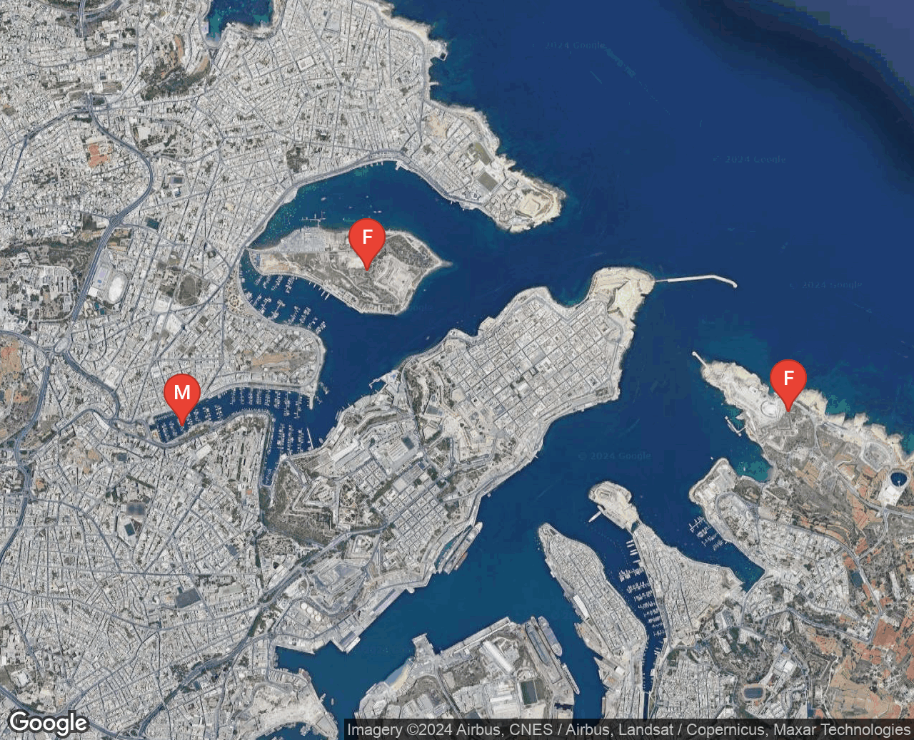

# maps-prep - a static maps processor and downloader 

I wrote this to prepare a series of maps for a book. I was preparing my grandfather's autobiography and wanted to add maps to the book. Since Google Maps allows you to statically download the maps, I thought a little processor to go from a yaml description, like this;

```
---
title: Malta Military Outposts
id: malta-military-outposts
from: apricot.blizzard.curving
to: pardon.school.suffix
locations:
  - id: msida
    title: Msida Torpedo Depot
    pt: library.petty.lays
  - id: fort-ricasoli
    title: Fort Ricasoli
    pt: spoiled.outraged.limo
  - id: fort-manoel
    title: Fort Manoel
    pt: admiringly.canine.shall
```

To a Google map PNG in `malta-military-outposts.png` would be a useful tool - so...



In the doc above, I'm using [What3Words](https://what3words.com/) locations as the points on the map, making it easier to specify and generally friendlier than lat/lng. So you can use the What3Words website to pick your locations (down to 10ft accuracy) and the app will convert them to lat/lng using the w3w API. What3Words has a free tier of 1000 conversions per month, and this app keeps your usage as low as possible by maintaining a location cache file;

```
# .map_prep/locations.yaml

topic.arena.insist:
  - 52.519904
  - -2.17582
lived.occupations.spacing:
  - 52.497938
  - -2.169036
```

Once this is done, the maps are prepared. The Google Static Maps API just requires you to create a URL of a specific format, and then perform a GET to download it.

Again, `map-prep` is designed to be cached - each URL is downloaded once, into a local folder, and will not be downloaded again if not needed. This makes it perfect for a build system, such as you end up with when compiling a book from Markdown.

Finally, the cached files are copied to a folder of your choosing, using a predictable naming scheme based on the `id` property of the map;

```
maps/out/
  early-life.png
  malta-military-outposts.png
```

This is so you can create reliable URLs to the maps, again from websites, markdown, etc.. 

So now, as you change your map definitions, map-prep keeps up with you.